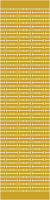
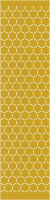

# Living Hinge Generator

Parametric lattice-hinge ("living hinge") SVG generator for laser cutting. Output is
millimetre-true — `1 user unit = 1mm` with a physical `width`/`height` — so it prints
and cuts at real size.

<table>
<tr>
<td align="center"><a href="examples/living-hinge-straight-50x200mm.svg"></a></td>
<td align="center"><a href="examples/living-hinge-dogbone-50x200mm.svg"></a></td>
<td align="center"><a href="examples/living-hinge-wave-50x200mm.svg"></a></td>
<td align="center"><a href="examples/living-hinge-chevron-50x200mm.svg"></a></td>
</tr>
<tr>
<td align="center"><sub>straight</sub></td>
<td align="center"><sub>dogbone</sub></td>
<td align="center"><sub>wave</sub></td>
<td align="center"><sub>chevron</sub></td>
</tr>
<tr>
<td align="center"><a href="examples/living-hinge-torsional-50x200mm.svg"></a></td>
<td align="center"><a href="examples/living-hinge-honeycomb-50x200mm.svg"></a></td>
<td align="center"><a href="examples/living-hinge-auxetic-50x200mm.svg"></a></td>
<td align="center"><a href="examples/living-hinge-crosshatch-50x200mm.svg"></a></td>
</tr>
<tr>
<td align="center"><sub>torsional</sub></td>
<td align="center"><sub>honeycomb</sub></td>
<td align="center"><sub>auxetic</sub></td>
<td align="center"><sub>crosshatch</sub></td>
</tr>
</table>

*All eight patterns at 50 × 200mm. Click one to download the cut file. The pictures are
display renderings — **gold is the panel that stays, cream the slits the laser removes** —
with the stroke thickened and painted onto the panel. A real cut file draws a hairline on
nothing at all, which a browser shows almost invisibly against a transparency
checkerboard.*

**[Read the writeup](https://gernreich.github.io/living-hinge/)**

Built for **[LaserMadeMusic](https://www.youtube.com/@LaserMadeMusic)**, where the cutting
and bending are shown.

**[Download everything as a ZIP](https://github.com/Gernreich/living-hinge/archive/refs/heads/main.zip)** — the CLI, the library, the guide, all eight examples and the coupons.

## Quick start

```
./living-hinge.js --list                          # patterns and their defaults
./living-hinge.js -p wave -w 80 -l 300            # 80 × 300mm wave hinge
./living-hinge.js -p chevron -w 80 -l 300 --margin 10   # with a 10mm margin
./living-hinge.js --help                          # every option
```

Every pattern is committed cut-ready in [`examples/`](examples) at 50 × 200mm, so you can
cut one without running anything. Those are the files the guide's per-pattern figures
describe.

Requires Node. No dependencies.

## Eight patterns

| Pattern | Defaults (mm) |
|---|---|
| `straight` | pitch 3, bridge 2 |
| `dogbone` | pitch 3, bridge 3, hole 0.5 |
| `wave` | pitch 3, bridge 2, wavelength 13, amplitude 1, step 0.5 |
| `chevron` | pitch 3, bridge 2, wavelength 13, amplitude 1 |
| `torsional` | pitch 3.5, bridge 2, cap 1 |
| `honeycomb` | side 5, gap 1.2 |
| `auxetic` | cell 6.25, gap 1.5 |
| `crosshatch` | cell 6.25, slit 4.5 |

## Before you cut

**Slits must reach the panel edges**, or the hinge does not flex. That constraint wins
over your other numbers: `--side` and `--cell` are fitted to the panel width, so they
are targets rather than guarantees, and the report tells you what they became.

**The stock is 3mm Baltic birch plywood**, and the defaults are aimed at it. **The tuning
numbers are still reasoned rather than tested**, though: bridge width decides whether a
hinge flexes or snaps, and the right value depends on your kerf as well as your stock. The
`coupons/` directory holds a bridge sweep for exactly that purpose — six otherwise
identical 40 × 120mm coupons varying only `--bridge`, so you can cut one sheet and
find out.

## Files

| | |
|---|---|
| `living-hinge.js` | the CLI — run it from this directory |
| `living-hinge-generator.js` | the geometry library it calls; must sit beside the CLI |
| `living-hinge-guide.md` · `.html` | operating guide; the markdown is the source |
| `NOTES.md` | how to reach this generator from a later session |
| `examples/` | one cut-ready file per pattern, all eight, at 50 × 200mm |
| `coupons/` | bridge-sweep test coupons and cut instructions |
| `index.html` | redirect that serves the guide on GitHub Pages |
| `previews/` | display renderings of every pattern — **not** cut files |

Released under [CC0 1.0](LICENSE).
